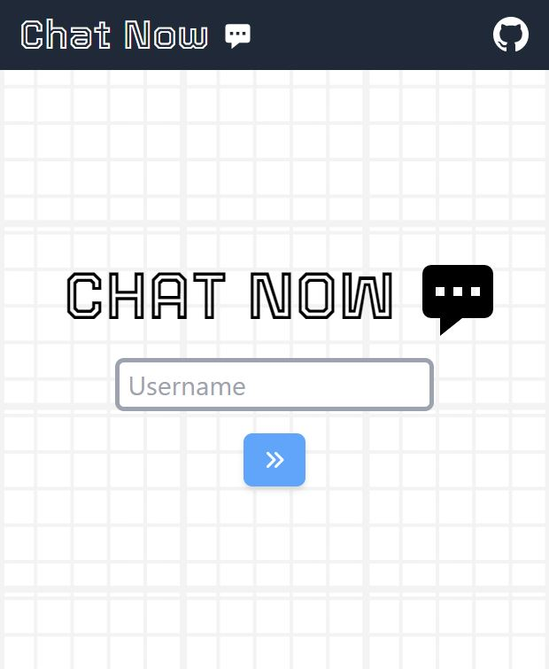
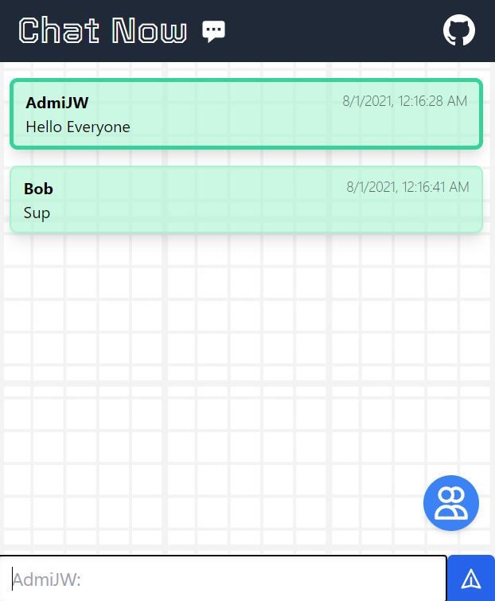

# 💬 Simple Chat Application 💬

Visit the application [__HERE__](https://chat-n0w.herokuapp.com/)

Simple Full Stack Chat Application made by AdmiJW using

* NodeJS + ExpressJS
* SocketIO
* ReactJS

Other modules include:

* `express-rate-limit`
* `rate-limiter-flexible`
* `helmetJS`

---
 

## Usage

1. Clone the repository. 
1. Setup the `.env` file in root directory [accordingly](#Environment-Variables). 
1. Run `npm install` in both the root directory and `react-frontend` directory. 
1. Run `npm start` from root directory.

## Environment Variables

| Environment Variable | Description |
|-|-|
| `PORT` | Port to run express app and SocketIO. Default to 3000 |
| `NODE_ENV` | `development` or `production` |

